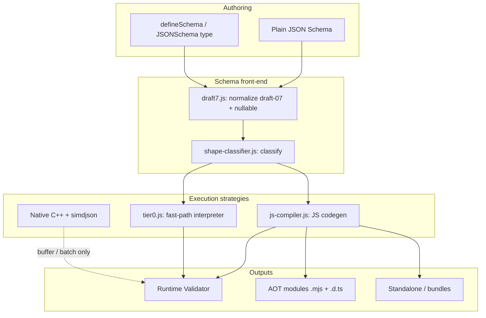
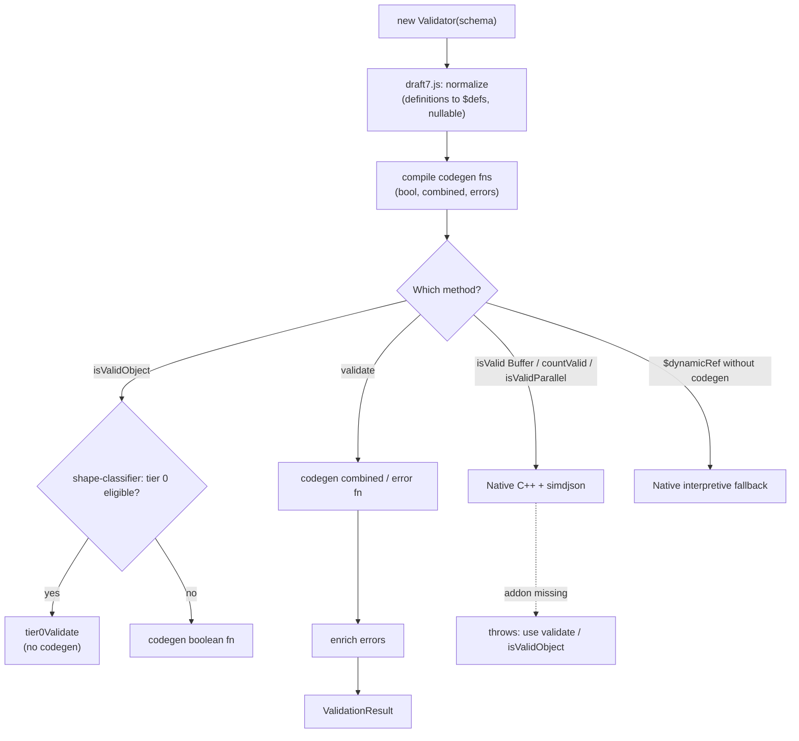
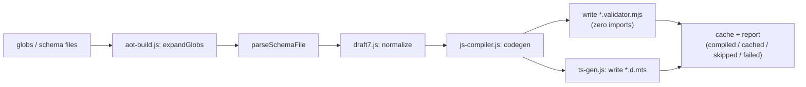
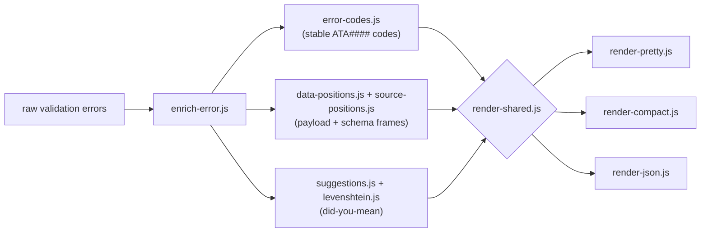
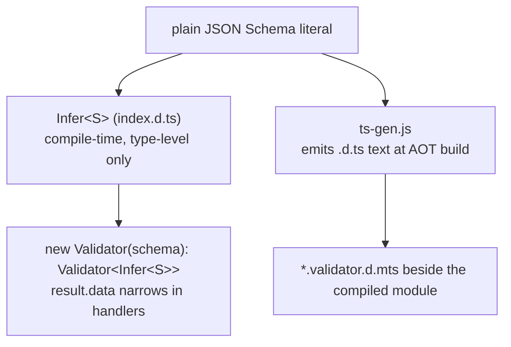
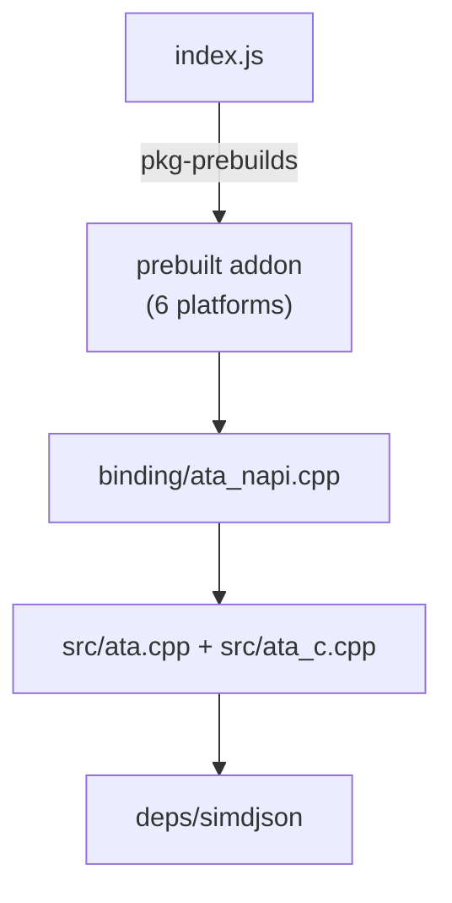

# ata Architecture

ata-validator is a JSON Schema validator with two faces: a runtime `Validator`
that compiles schemas on demand, and an ahead-of-time (AOT) compiler that turns
schemas into standalone, zero-dependency JavaScript modules at build time. Types
are inferred from plain JSON Schema, with no builder DSL. The native C++ engine
(simdjson) is optional and only powers the buffer and batch paths; core
`validate()` runs on pure JS and works in the browser.

This document describes the architecture as of 0.19.0.

## Design principles

- **Pure JS by default, native by opt-in.** Nothing in the core validate path
  requires the native addon. Native accelerates buffer/NDJSON workloads only.
- **Compile, do not interpret (where it pays).** Hot schemas are turned into
  specialized JavaScript functions. A small interpreter (tier 0) covers trivial
  schemas without paying codegen cost.
- **Plain JSON Schema is the source of truth.** Types, runtime validation, and
  AOT output all derive from the same plain schema literal.
- **Zero-eval, shippable output.** The AOT path emits static modules with no
  `Function`/`eval`, safe under strict CSP and on the edge.

## Component map



## Packaging and entry points

| File | Role |
| --- | --- |
| `index.js` | CommonJS entry. Loads the optional native addon, exposes `Validator`, `validate`, `compile`, bundles. |
| `index.mjs` | ESM entry (re-exports the CJS core). |
| `index.browser.mjs` | Browser build. No native addon, pure JS codegen only. |
| `index.d.ts` | Public types: `Validator<T>`, `Infer<S>`, `defineSchema`, `JSONSchema`, Standard Schema. |
| `build.js` / `build.mjs` / `build.d.ts` | Programmatic AOT build API (`build`, `watch`, `expandGlobs`). |
| `compat.js` / `compat.mjs` / `compat.d.ts` | Drop-in shim for the default validator's API. |
| `bin/ata.js` | CLI: `ata compile`, `ata build`, `ata validate`. |

## Runtime validation: three-tier dispatch

`new Validator(schema)` normalizes the schema once, then chooses an execution
strategy per call. The cheapest strategy that fits the schema and the input wins.



- **Tier 0** (`lib/tier0.js`): a small interpreter for trivial shapes, built
  lazily on the first `isValidObject` call so cold start stays cheap.
- **JS codegen** (`lib/js-compiler.js`): the core. Emits specialized functions:
  - `compileToJSCodegen` — boolean fast path
  - `compileToJSCombined` — returns the `{ valid, data, errors }` result shape
  - `compileToJSCodegenWithErrors` — error-collecting path
  - `compileToJS` — closure-array fallback when codegen cannot represent a shape
  - `lib/branch-collapse.js` folds redundant conditionals; `lib/safe-regex.js`
    routes `pattern`/`patternProperties`/`propertyNames` and built-in formats
    through a linear-time engine (ReDoS-safe).
- **Native C++** (`src/ata.cpp`, `binding/ata_napi.cpp`, `deps/simdjson`): powers
  `isValid(Buffer)`, `countValid`, `isValidParallel`, `validateAndParse`, and the
  interpretive fallback for cases JS codegen does not cover (e.g. `$dynamicRef`).
  Loaded via `pkg-prebuilds`; absent native, the buffer/batch methods throw and
  everything else keeps working on JS.

## AOT build pipeline

`ata build`/`ata compile` and the programmatic `build()` API compile schemas to
standalone modules at build time. No validator dependency is shipped.



### Standalone and bundle output

The same codegen backs three in-process emitters on `Validator`:

| Method | Output |
| --- | --- |
| `toStandalone()` | Module string that still imports ata-validator. |
| `toStandaloneModule()` | Fully self-contained module, zero dependency. |
| `Validator.bundleStandalone()` | Multiple schemas, one zero-dep module. |
| `Validator.bundleCompact()` | Bundle with shared template de-duplication. |

## Error enrichment pipeline

Raw codegen errors are enriched into compiler-grade diagnostics, then rendered.



## TypeScript type system

Two distinct, independent paths produce TypeScript types. Do not confuse them.



- **`Infer<S>`** (`index.d.ts`): a recursive, type-level mapping evaluated by
  `tsc`. Resolves primitives, `const`/`enum`, objects (required vs optional),
  arrays, `prefixItems` (tuples), `anyOf`/`oneOf` (unions), `allOf`
  (intersections), and `$ref` into local `#/$defs` or `#/definitions` (recursive
  refs included). It threads the root defs map down the recursion so refs can be
  resolved. External/unresolvable refs degrade to `unknown`, never an error.
- **`ts-gen.js`**: generates `.d.ts` *source text* during the AOT build, paired
  with each compiled `.mjs`. It also encodes runtime-only constraints
  (`minLength`, `format`, ranges) as JSDoc tags on the emitted types.

## Native layer



The native addon is optional and only required for the buffer and batch APIs.
Prebuilt binaries ship for the supported platforms, so installation does not
require a local toolchain. When the addon is unavailable, ata transparently
runs the JS path.

## Module reference

| Module | Responsibility |
| --- | --- |
| `lib/js-compiler.js` | Core schema to JavaScript codegen (all variants). |
| `lib/aot-build.js` | AOT build orchestration: globbing, parsing, caching, reporting. |
| `lib/draft7.js` | Draft-07 normalization and OpenAPI `nullable` handling. |
| `lib/shape-classifier.js` | Classifies a schema to pick the execution strategy. |
| `lib/tier0.js` | Fast-path interpreter for trivial schemas. |
| `lib/branch-collapse.js` | Codegen optimization: collapse redundant branches. |
| `lib/safe-regex.js` | Linear-time, ReDoS-safe regex and built-in formats. |
| `lib/ts-gen.js` | Emits `.d.ts` source text for AOT outputs. |
| `lib/enrich-error.js` | Turns raw errors into coded, framed diagnostics. |
| `lib/error-codes.js` | Stable `ATA####` error code registry. |
| `lib/data-positions.js`, `lib/data-position-cache.js` | Maps payload byte offsets to line/col. |
| `lib/source-positions.js` | Maps schema elements to source frames. |
| `lib/suggestions.js`, `lib/levenshtein.js` | Typo and format suggestions. |
| `lib/render-pretty.js`, `lib/render-compact.js`, `lib/render-json.js`, `lib/render-shared.js` | Error renderers. |
| `src/ata.cpp`, `src/ata_c.cpp`, `binding/ata_napi.cpp` | Native engine and N-API bindings. |
| `deps/simdjson` | Vendored simdjson for the native fast path. |
```
